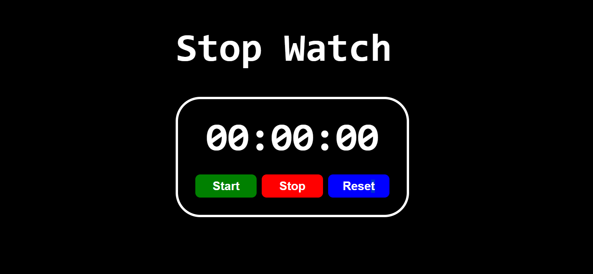

# Stop Watch

A simple and elegant stopwatch application built using React.

## Deployed Link

Check out the live version of the Stop Watch [here](https://66825fb2fab9d0f2a1b7b302--sparkling-kitten-397e4b.netlify.app/).

## Preview



## Getting Started

To get a local copy up and running, follow these steps.

### Prerequisites

Make sure you have Node.js and npm installed. You can download them from [Node.js](https://nodejs.org/).

### Installation

1. Clone the repository:

2. Navigate to the project directory

3. Install the dependencies:
    ```sh
    npm install
    ```

### Running the Application

To start the development server, run:
```sh
npm run dev
```

## Built With

- [React](https://reactjs.org/) - A JavaScript library for building user interfaces.

